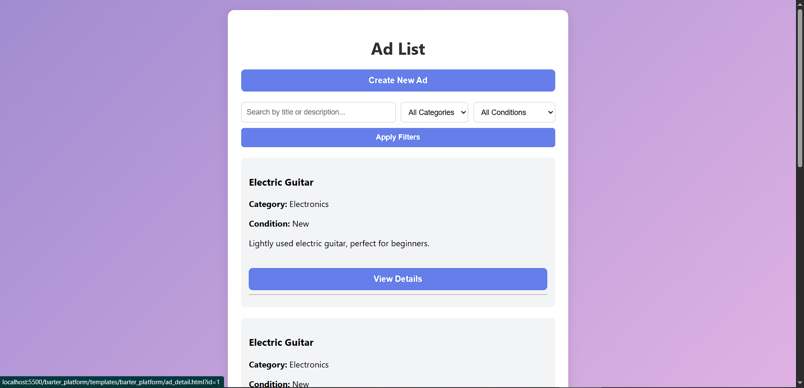
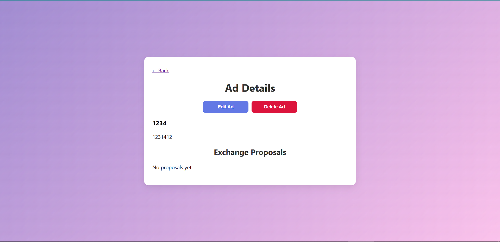
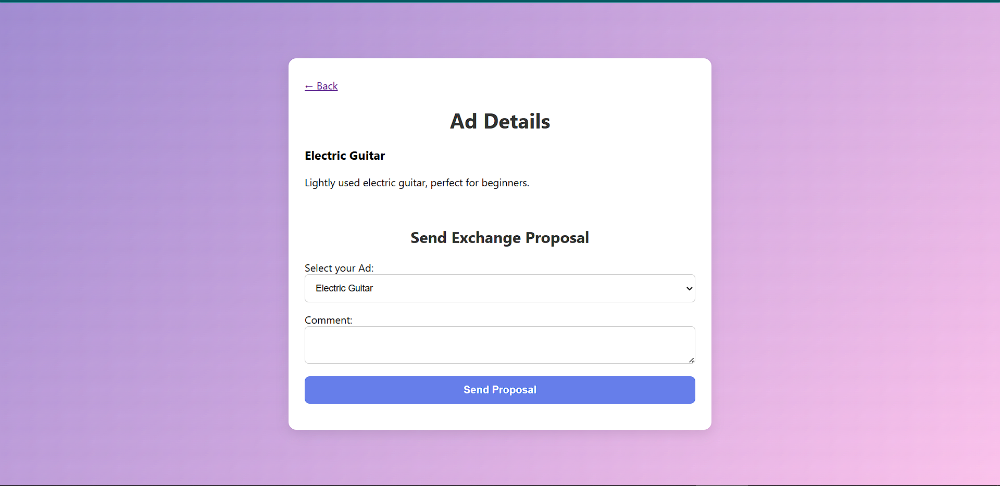

# Barter Platform

Barter Platform — это веб-приложение на Django + Django REST Framework для публикации объявлений и обмена товарами между пользователями. Проект включает систему авторизации, CRUD-операции для объявлений и систему предложений обмена.

## Технологии

* Python 3.12
* Django 4+
* Django REST Framework
* HTML, CSS, JavaScript (Vanilla)
* SQLite (Default)
* JWT (simplejwt)

## Возможности

* Регистрация и вход по email и паролю
* Создание, просмотр, редактирование, удаление объявлений
* Загрузка изображений по URL
* Фильтрация по категории и состоянию, поиск по title/description
* Отправка и приём предложений обмена
* Обновление статуса (ожидает, принят, отклонён)
* Разграничение доступа: только владелец видит кнопки и обмены

## Установка

```bash
git clone https://github.com/your-username/barter-platform.git
cd barter-platform
pip install -r requirements.txt
python manage.py migrate
python manage.py runserver
```
## Фронтенд

Фронтенд (HTML/JS) рекомендуется запускать отдельно, например, с помощью Live Server на `localhost:5500` или Python HTTP Server
## Скриншоты




## Основная структура

```
barter_platform/
├── ads/
│   ├── models.py
│   ├── serializers.py
│   ├── views.py
│   └── urls.py
├── users/
│   ├── models.py
│   ├── serializers.py
│   ├── views.py
│   └──urls.py
├── screenshots/
├── templates/
│   ├── ad_list.html
│   ├── ad_detail.html
│   ├── ad_create.html
│   └── ad_edit.html
├── static/
│   └── styles.css
├── manage.py
└── requirements.txt
```

## API Эндпоинты

| Endpoint                      | Method             | Description                 |
| ----------------------------- | ------------------ | --------------------------- |
| `/api/v1/auth/`               | POST               | JWT auth (simplejwt)        |
| `/api/v1/ads/ads/`            | GET, POST          | List / Create ads           |
| `/api/v1/ads/ads/<id>/`       | GET, PATCH, DELETE | Detail / Update / Delete ad |
| `/api/v1/ads/proposals/`      | GET, POST          | List / Send proposals       |
| `/api/v1/ads/proposals/<id>/` | PATCH              | Update proposal status      |
| `swagger/`                    | -                  | Swagger UI                  |
| `redoc/`                      | -                  | Redoc API docs              |

## TODO

* [x] Регистрация и логин
* [x] CRUD для объявлений
* [x] Обмен и фильтрация
* [x] Ограничения доступа

## Лицензия

MIT License

Разработано для ТЗ
Автор: 6igsm0ke
